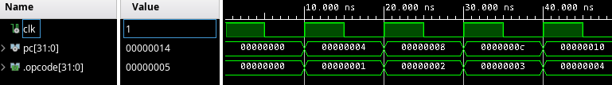

{
	"title": "Fetch stage"
}

This lesson starts at commit [8e8cf23ea6f3e34ae18a7bddce8bd375d43a85dd](https://github.com/rubenvannieuwpoort/course_cpu/commit/8e8cf23ea6f3e34ae18a7bddce8bd375d43a85dd).

# 2. Fetch stage

With our main project structure set up, we can start working on the core itself; specifically, on the *fetch* stage. This stage does nothing more than loading opcodes from the memory and passing them on to the next stage in the pipeline.

### Fetch stage

*Loading opcodes from memory?* I hear you ask. Erm, yeah... At this point we have not implemented any memory yet. Doing this properly is a bit of work, and for now I just want to get our CPU into a state where it can do something, so that we can get our dopamine hit. So, for now, we're going to implement a quick hack and implement our memory as a simple array of 32-bit bitfields.

First, we'll declare a type `instruction_memory_t` for holding the instructions. In RISC-V, instructions are 32 bits wide (if you are not using the ["C" extension for compressed instructions](https://docs.riscv.org/reference/isa/unpriv/c-st-ext.html), which we are not). I choose to make our memory 16 instructions big, because that seemed large enough to hold very simple programs in assembly without becoming unwieldy. We can simply increase this number if we want to execute longer programs, and we'll eventually switch to a better memory implementation anyway.

For now, I'll just fill the instruction memory with zero bits.

!!Add initial implementation of instruction memory

Now, we'll also want a signal to keep track of number (or *address*) of the current instruction. This is typically called the *program counter* and abbreviated to "PC". I'll make our program counter of type `unsigned` so that we can increase it without having to do too many casts. In RISC-V, the program counter is 32 bits wide, so I'll use 32 bits as well.

!!Add program counter

Now, we'll want to increase the program counter to point to the next instruction after passing the instruction at the current program counter to the next stage. Now, the program counter is a byte address, and since our instructions are 32 bits wide, we need to increase the program counter by 4 every cycle. For now we'll just assume we can output an instruction every cycle.

!!Increase program counter

So far so good. After simulating this we can see it works as expected.

Now, we'll also want to fetch the instruction (or *opcode*) at the address that the program counter points to, and pass it to the next stage. So, let's add an output for it.

!!Add opcode output to fetch stage

Let's actually fetch the opcode from the instruction memory and set it in the output.

!!Fetch opcode from memory

To test this, let's fill the instruction memory with a counter that starts at one (to be able to distinguish between an "empty" opcode and the first opcode).

!!Fill instruction memory with counting patterns

If we now simulate the `clk`, `pc`, and `output` for 50 ns, we get the following waveforms:

We can see that:
1. The value of the opcode lags behind the value of the `pc` register by one cycle.
2. For the first cycle, the opcode in the output is empty.

Both are fairly typical problems you run into when doing hardware design.

The issue of different values being out of sync is not a real problem, but can be a bit confusing. It happens because the value of `output.opcode` is set based on the value of `pc`. Their values are simultaneously updated on a rising edge of the clock, where `output.opcode` uses the *old* value of the `pc`. This is completely fine, so we don't need to make any changes at this point. The reason I am bringing it up, is that it's very important to be aware of things like this when we try to reason about what's going on in our CPU.

The second point is actually a problem, and we'll address it by adding an `is_active` flag in the output of the fetch stage and setting it to zero in the default value. If this flag is zero, the output is empty and should be ignored by other stages. We'll have to add similar flags to the output of the other stages later.

!!Add is_active flag in fetch output

We have to set the flag to one whenever we output an opcode.

!!Set is_active flag to one when outputting opcode

Now, let's simulate the waveforms again to verify that the issue is fixed:

This looks good; the first time the `is_active` is `1`, the `opcode` field is `00000001`. The `output.opcode` field is still lagging behind `pc` one cycle, but as noted, this is not a problem.
