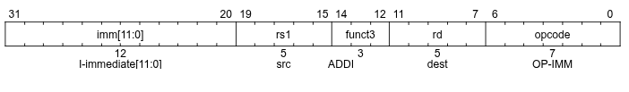
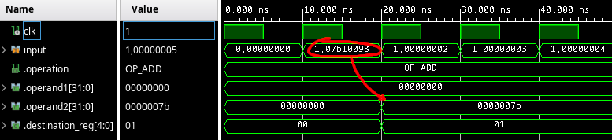
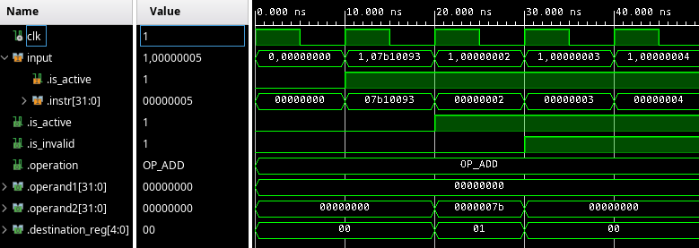

{
	"title": "Decode stage"
}

This lesson starts at commit [795a0822522cbd280e9a7a6c1fb669344b6dd048](https://github.com/rubenvannieuwpoort/course_cpu/commit/795a0822522cbd280e9a7a6c1fb669344b6dd048).

# 3. Decode stage

Now that we have hacked together an intial implementation for our fetch stage, we can proceed with the *decoder*. This stage, simply puts, translates the raw bits of the opcodes into the *control signals* which are used by the later stages to actual execute the instruction. So, simply put, the decode stage is the stage that tells the other stages after it what to do.

Maybe this is a bit abstract, so let's take a look at an example instruction. Let's take a simple and familiar example: The `ADDI` instruction, which takes a register, adds an *immediate* value -- a value that is encoded in the instruction itself -- and saves the result in the destination register.

For example, we can write `ADDI x1, x2, 34`. Here, `x1` is the destination register. Its value will be set to the value of `x2`, plus `34`. So, if the value of `x2` would be `5`, executing this instruction would set the value of `x1` to `39`.

For this instruction, the decode stage would set the following values in its output:
- `operand1` would get the value of the `x2` register, `5`.
- `operand2` would get the immediate value, `34`.
- `write_register` would get the number `1` which represents the register `x1`.
- `operation` would get the value of a constant that indicates that the execute stage should add the operands; let's call it `OP_ADD`.

To find out how the different instructions should be implemented, you should refer to "The RISC-V Instruction Set Manual Volume I", which can be found on [the website for the RISC-V documentation](https://docs.riscv.org/). Specifically, I recommend using
- **Chapter 2 - RV32I Base Integer Instruction Set** for the semantics and encoding of the instructions
- **Chapter 35 - RV32/64G Instruction Set Listings** for the encoding of the instructions.

It might be worth it to print these chapters!

*For the instruction set listings, I recommend looking at the PDF format. In the PDF version, you can very easily what fields end up in what bit positions. At the time of writing, it's practically impossible to see this in the web version.*

Let's look at the `ADDI` instruction again. In the RISC-V ISA manual we can read:
> `ADDI` adds the sign-extended 12-bit immediate to register *rs1*. Arithmetic overflow is ignored and the result is simply the low XLEN bits of the result. 

We can also see the following schematic for the encoding:

In the schematic, the most significant bits are on the left and the least significant bits on the right. The `funct7`, `funct3`, and `opcode` fields are just constants -- the bits in the corresponding places need to have a certain, fixed value. These values are listed in the instruction set listings in chapter 35, where we can see that for the `ADDI` instruction:
- `funct3` has the value `000`
- `opcode` has the value `0010011`

With that out of the way... Let's start coding.

We want the decoder only to try to decode when the `is_active` flag is set.

!! c921175f13845a07e02bd2b72bc4075cc1d64acf

Let's start with recognizing the `ADDI` instruction by checking the values of the `funct3`, and `opcode` fields. Since many other opcodes use the same fields, I'll add variables for them, so that they can be re-used.

!! 4fb8f17716af95532d4d1abf4d12a1587407141d

Now, if we recognize the `ADDI` instruction, we want to set the control signals, so we need to define some types and constants for them in the output type.

!! b06e86890619a5b0e3bd50fb37fc2d081e6ef300

We'll define an enumeration type for the operation that the execute stage has to perform. For now, it will know a single operation, `OP_ADD`. We don't really need a "no operation" (NOP) value, the execute stage can just add the operands and not use the result, and it will be functionally the same as executing a NOP.

!! 2591ac193af829e317ee26a1731a2ed1590977d6

Now, we can finally set the output.

!! cc5be9922a3176257e91e700d0244b21c49414a2

Hmm, we still need to load values from registers. Normally you'd do this in a dedicated *register file*, but I will just define the registers here in the decode stage. If this will lead to any problems later on, we'll just deal with them at that point.

!! 8fb08384099f555a444bbf7b55ac524e3ce2aaa3

Now, we can actually read the value from the registers when we set the output.

!! 97b68a5188c4a7e216561b3fa238d2e0b618a460

At this point the simulation is working, but does nothing. We'd like to execute the `ADDI` instruction. It's a good exercise to try to write the instruction bits of a simple `ADDI` instruction by hand. Let's do `ADDI x1, x2, 123`.

In the instruction set listing in the RISC-V documentation, we can find all the fields in the encoding for the `ADDI` instruction. In order from left to right (so most signficant to least significant bits), they are:
- The immediate field, which we set to `123`, or, written as a 12-bit binary number, `000001111011`
- The `rs1` field (the number of the register of the first operand), which will be `2` for the `x2` register, or `00010` as a 5-bit binary number
- The `funct3` field, which is `000` for `ADDI`
- The `rd` field, which is `1` for the `x1` register, or `00001` as a 5-bit binary number
- The `opcode` field, which is `0010011` for `ADDI`

Concatenating all the bits we get `00000111101100010000000010010011`. Counting the bits, we see that indeed, we have 32 bits as expected. If we [write this in hex](https://www.wolframalpha.com/input?i=00000111101100010000000010010011+from+binary+to+hex), which is a more commonly used format for instruction code, we get `7b10093`.

Indeed, if I enter `addi x1, x0, 123` in [this online RISC-V assembler](https://riscvasm.lucasteske.dev/), it returns `07b10093`.

Now, we replace the first opcode by this value for testing.

!! 1f04817d7054b1d6cd6564f7f069e3e82d641f81

Now, we run the simulation for 50 ns and observe the inputs and outputs of the decode stage to verify everything is working as expected.

Now, we can see that in the second cycle, the `ADDI x1, x2, 123` instruction we enters the decode stage. The next cycle, we see that the destination register is set to `1`, indicating that the result of the operation should be written to `x1`. The second operand is also set to `7b`, which is the hex encoding of `123`. The first operand is set to `0`, which is correct, since all registers are initialized to zero. It's a bit hard to verify that this comes from the correct register, but I'll trust this for now.

The cycle after that, we expect the output of the decode stage to be the same as the output before the `ADDI` instruction was decoded. However, the output stays the same, as if there was another, identical `ADDI` instruction right after the one we put.

So, we need to handle the case where no instruction is recognized in the decoder. In this case, I want to set the output to the default output. I also want to have an `is_active` flag like we have in the output of the fetch stage.

!! 2f1e682181dfe848ccded6b020f617105ccd36df

Another problem is that we can't distinguish between "there was no instruction" and "the instruction could not be decoded". For this, I'd also like a flag to indicate when the decoder failed to decode an instruction. In this case, we'll interpret the instruction as an invalid instruction. Of course, until we have implemented decoding for all the RISC-V instructions, the instructions for which an implementation is missing will get tagged as invalid.

!! d20e09da83bc7dac0d753d0a4db9a9ce99c50327

I refactored the code slightly to use a variable, so that we can use `DEFAULT_DECODE_OUTPUT` by default and can overwrite individual fields of the output. This is not allowed for signals.

When we simulate again, the waveforms look like this.

This is good; the first cycle and second cycle we see the output is not active (because the decode stage has not received any "active" output from the fetch stage yet). The third cycle we see that the decode output is active and valid and the operands as well as the operation and the destination register are correct. The cycles after that, the `is_invalid` flag is set, which is correct because the other instructions are still the values that count up, which are not correct instructions.

Now, decoding the other arithmetic instructions will be relatively straightforward. But first, we will focus on the rest of the stages, so that we can actually see our implementation of the `ADDI` instruction work.
