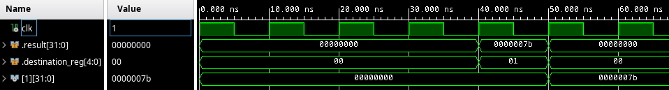
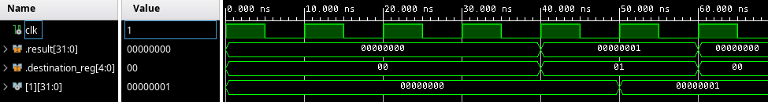
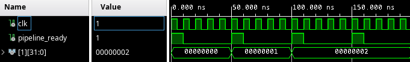

{
	"title": "Execute and writeback stages"
}

This lesson starts at commit [d20e09da83bc7dac0d753d0a4db9a9ce99c50327](https://github.com/rubenvannieuwpoort/course_cpu/commit/d20e09da83bc7dac0d753d0a4db9a9ce99c50327).

# 4. Execute and writeback stage

To recap, we have
1. A fetch stage (which is a temporary hack that should be re-done, but for now it allows us to keep making progress).
2. A decode stage, which only decodes the `ADDI` instruction.

The goal for this lesson is to actually execute the `ADDI` instruction and write the result back to the target register. Naturally, this requires changes to the execute and writeback stages.

From the execute stage, we want to return the result from the operation, and the destination register.

!! fbc3f2e0a5a11afe5f428ce1cb39f87bdec5f89a

We want to pass this on to the writeback stage, but the memory stage is inbetween, still. We'll adapt the memory stage to just copy the input.

!! 7b9a59f1a54e5a95573544fd372aafdca7900371

Now, we still need to provide the actual implementations in the execute and writeback stage.

In the execute stage, we want to ignore inactive signals and invalid instructions (we will need to handle invalid instructions some day, but today is not that day). For invalid or inactive instructions we'll simply output the default output. To signal "we don't need to write to a register", we simply set the destination register to 0, because in RISC-V the first register, `x0`, always holds zero, and it cannot be overwritten. We'll need to handle this in the writeback stage.

!! a9b29a4c510e971b769977dda63ae673fab49ad0

Now, we're ready to actually handle the addition operation in the execute stage.

!! 38d10e66e2e68e26d5e83a4d5bdec0f6042b4337

We can make the "this should never happen" a bit more robust by making it an assertion.

!! fabc51706b5db151081cc2cd9d77b6609735bc97

If we test this in simulation, we see the correct values for `result` and `destination_reg` show up in the writeback stage.

However, the writeback stage itself doesn't do anything. We run into a problem here; In the last lesson we put the registers in the decode stage, so we don't have access to them from the write stage...

Like I mentioned last time, one solution is to make a module for a register file, that the decode stage and the writeback stage can both talk to. However, I don't really like making an additional module, and instead I'll opt to *merge* the writeback stage and the decode stage into a single module, which I'll simply call `decode_write`. I will adapt the `decode` module and delete the `write` module (which was only a placeholder anyway).

So, the `core` module will need to route the output of the memory stage back to the decode stage, which will then handle writing the final value to the destination register.

First, I'll rename `decode.vhd` to `decode_write.vhd` and delete `write.vhd`.

!! d18a90f437c58466492d07bfc34b8d27f073fb79

Then, I'll make the `decode_write` module take the output from the memory stage.

!! d35c421503f48b106cc16757f13a2928c6d702ef

Now, it's relatively easy to perform the write to the destination register.

!! 008d0582d6e23d030f0e941e7d7290a800b1ef89

If we simulate this for 70 ns and observer the input to the write stage and the `x1` register, we see the following waveforms.



This looks good; The value `0x7b` (which is 123 in hex) gets written to the `x1` register. We have implemented our first RISC-V instruction, and it looks like it's being executed correctly! You can give yourself a pat on the back, this is a nice milestone!

When you're done celebrating, let's try another test case, that increments the `x1` register twice in a row. That is, let's execute
```
ADDI x1, x1, 1
ADDI x1, x1, 1
```

Again using [this sweet online RISC-V assembler](https://riscvasm.lucasteske.dev/), we see that `ADDI x1, x1, 1` assembles to `00108093`. We put this instruction in our instruction memory twice.

!! 48faab7325b90a50ca9d4b9853ff8377a3b58c86

Now we run the simulation again for 70 ns, observing the input for the write stage, and the value of the `x1` register.



We can see that in the fifth and sixth cycle, a write to the `x1` register happens (`destination_reg` is set to `1`). However, the value of `result`, which is written to the register, should be `2` the second time. So, we have a bug.

What is going on? When the second `ADDI x1, x1, 1` instruction arrives in the decode stage, the value of the `x1` is read as `0`, since the instruction before it has not yet finished executing.

This phenomenon where one instruction needs the result of an instruction before it that has not yet finished, is known as a *read-after-write hazard*. In pipelined processors, you need to track these dependencies, and wait until all the dependencies have finished executing. The cycles where the processor is waiting are called "pipeline bubbles" or "pipeline stalls". In our case, these manifest as cycles where the output of a stage has the `is_active` set to `0`.

So the proper solution is to keep track of the number of instructions in the pipeline that write to every register. However, I don't feel like doing that at this point. Instead, I am going to do something much simpler for now: Let the fetch wait until the previous instruction has finished. This is potentially much slower than doing the proper solution, but I *really* want to get a simple processor working before spending a lot of effort to pipeline it.

So, what we can do is add an output `pipeline_ready` to the write stage, that will be set to `1` for a cycle whenever an active instruction finishes. This signal will then be fed back to the fetch stage, and a new instruction will only be fetched when this signal is `1`.

For this, first we need to propagate the `is_active` signal all the way to the write stage.

!! c1d74ad60514d608a8f284bd627137271ed63277

With that done, we "loop" the signal back around as `pipeline_ready` from the write stage back to the fetch stage, and only fetch if it's `1`. We initialize the value to `1` in the output of the write stage to not get in a "deadlock", with the pipeline waiting for an instruction, and the fetch unit waiting until an instruction finishes.

!! 633a2f7416a413fba17ba057baebb396ba347970

With this change, we see the value of `x1` settles on `2`, after 100 ns.



So, that we can now also succesfully execute multiple successive `ADDI` instructions. In the next lesson, we'll look at implementing more instructions.
