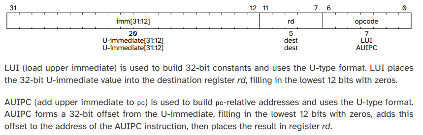

{
	"title": "Implementing more instructions"
}

This lesson starts at commit [52ad976f12300a37998296b9861bfa7bccabac4a](https://github.com/rubenvannieuwpoort/course_cpu/commit/52ad976f12300a37998296b9861bfa7bccabac4a).

# 6. Implementing more instructions

After the hopefully fun diversion in the last lesson, we are back to work. There are 40-ish instructions in the RISC-V base instruction set, and we have only implemented two so far. Let's bang out some more instructions!

Let's grab the RV32/64G Instruction Set Listings of the RISC-V docs.

First, let's just add variables for all the bit fields we don't have yet.

!!Add variables for all bitfields

Now, let's remove the decoding logic we currently have and just start implementing the instructions from the RV32/64G Instruction Set Listings.

!!Remove old decoding logic

So we start with `LUI` and `AUIPC`. In Chapter 2 (RV32I Base Integer Instruction Set) of the RISC-V unprivileged architecture document, we find this:

In chapter 35, we see that the `opcode` field is `0110111` for `LUI` and `0010111` for `AUIPC`.

!!Recognize LUI and AUIPC

So, we start with `LUI`. We need to place the immediate value in the `rd` register. This is easy enough with the existing infrastructure.

!!Implement LUI

`AUIPC` is similar, but the it adds the immediate to the address of the instruction. This address is in the `pc` register in the `fetch` stage, but not yet available in the `decode` stage, so we need to pass it in the output of the `fetch` stage.

!!Add pc to output of fetch stage

Now, we can implement `AUIPC` similar to `LUI` in the decode stage.

!!Implement AUIPC

Now, `JAL` and `JALR` are control flow instructions, which mean we'll have to somehow change the value of the `pc` register in the fetch stage. This requires changes in at least 3 modules as well as some testing. This is a bit too much work for this lesson; we'll just work on the "low-hanging fruit" now, and will return to the instructions that require more work later.

!!Recognize JAL and JALR instructions

Now, `BEQ`, `BNE`, `BLT`, `BGE`, `BLTU`, and `BGEU` are control flow instructions as well, so we skip them too. 

!!Recognize BEQ, BNE, BLT, BGE, BLTU, BGEU

We'll also skip `LB`, `LH`, `LW`, `LBU`, `LHU`, `SB`, `SH`, `SW` because these are memory operations and we haven't implemented memory yet. So far, this is going *excellent*.

!!Recognize loads and stores

Now, we arrive at a bunch of instructions that have the same opcode (but a different value for the `funct3` field): `ADDI`, `SLTI`, `SLTIU`, `XORI`, `ORI`, `ANDI`.

First, we want to recognize these instructions.

!!Recognize ADDI, SLTI, SLTIU, XORI, ORI, ANDI

We have implemented `ADDI` before, so we can just add that code back.

!!Implement ADDI

The other instructions are very similar, but the exact operation that is executed in the execute stage is slightly different. So we can structure the code a bit differently to take advantage of the similarity.

!!Structure decoder logic more efficiently

Now we add a couple of operations so that we can decode `SLTI`, `SLTIU`, `XORI`, `ORI`, `ANDI`.

!!Implement instruction decoding of SLTI, SLTIU, XORI, ORI, ANDI

Now we still have to implement these operations in the execute module.

`OP_SLT` compares two operands as signed numbers, and sets 1 when the first operand is less than the second.

!!Implement SLT operation

`OP_SLTU` is similar but works on unsigned operands.

!!Implement SLTU operation

`OP_XOR`, `OP_OR`, and `OP_AND` are similar and simple to implement.

!!Implement OP_XOR, OP_OR, and OP_AND

Now, `SLLI`, `SRLI`, and `SRAI` are similar to eachother but different from the instructions we just implemented, but for some reason all share the same opcode. I'll put these three instructions above the ones we just implemented, so that we can use slightly less logic.

!!Recognize SLLI, SRLI, and SRAI instructions

Again, we add operations to implement the decoding of these instructions.

!!Implement instruction decoding of SLLI, SRLI, SRAI

Then we implement the operations themselves. The shift instructions are a bit weird. The manual mentions
> The operand to be shifted is in *rs1*, and the shift amount is encoded in the lower 5 bits of the I-immediate field.

This means that you can shift by at most 31 bits. Janky as hell in my opinion, but we're just implementing the spec, not making it.

A nice way of implementing shifts by a variable number of bits, say `n`, is two do the shift as a sequence of shifts of powers of two. If `n` is 5-bits, and the most significant bit of `n` is set, we shift by 16 bits. If the next bit is set, we shift by 8 bits, etc., etc. At the end, we'll have shifted by `n` bits.

!!Implement OP_SLL, OP_SRL, OP_SRA

This is a big change, but it's (almost) the same verbose code. In fact, we can merge the implementations of the two right shifts (`SRL` and `SRA`).

!!Merge implementations of SRL and SRA

Moving on; almost all of the instructions with opcode `0110011` are register-register versions of instructions we already implemented. The `SUB` instruction is the only exception.

As usual I'll add placeholders first.

!!Recognize ADD, SUB, SLL, SLT, SLTU, XOR, SRL, SRA, OR, AND

Now we'll add the implementation.

!!Implement ADD, SUB, SLL, SLT, SLTU, XOR, SRL, SRA, OR, AND

Now, we just have to implement `OP_SUB` in the decoder.

!!Implement OP_SUB

OK, phew. Just a couple of oddball instructions left. `FENCE` is used for memory ordering. We don't even have memory yet, so for now we'll make this a NOP.

!!Implement FENCE as NOP

Now, `FENCE.TSO` and `PAUSE` are special cases of `FENCE`, which we already handle. So we can skip them; We'll look if we can do something better later.

`ECALL` and `EBREAK` are traps, which we have not implemented yet. So I'll add the logic to be able to easily decode them later, but otherwise ignore them.

!!Recognize ECALL and EBREAK

Now that we're done, let's add back our custom "LED" and "HANG" instructions.

!!Add back custom LED and HANG instructions

Phew, we added a lot of instructions! We added the decoding for all instructions and actually implemented about half of all the instructions in the basic RV32 ISA. Not bad for a single lesson.

Did we forget anything? Testing, you say?
