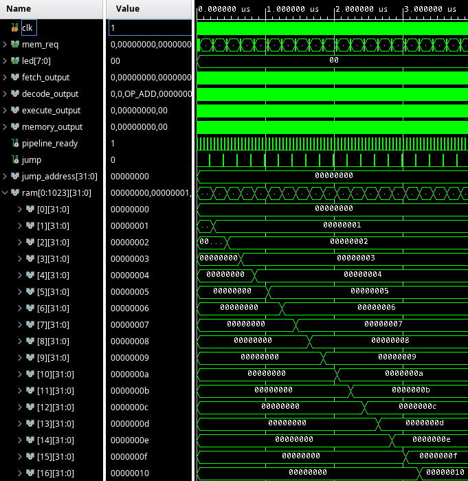

{
	"title": "Memory"
}

This lesson starts at commit [c2c6ad9e07ff149a1de3863f1d10db636e966997](https://github.com/rubenvannieuwpoort/course_cpu/commit/c2c6ad9e07ff149a1de3863f1d10db636e966997).

# 8. Memory

We'll start with a simple implementation of the memory subsystem, which we need for the load and store instructions. There is quite a lot which we'll need to do for this module, so we'll start on familiar ground and take small steps.

We'll start by implement the store instructions, and specifically, the `SW` (store word) instruction. The familiar ground we're starting from is the decoder; we'll just do what we have done dozens of times before: Add some decoding logic.

The RISC-V docs say this about the store instructions:
> Load and store instructions transfer a value between the registers and memory. [...] The effective address is obtained by adding register *rs1* to the sign-extended 12-bit offset. [...] Stores copy the value in register *rs2* to memory.

We'll use the first operand to store the address and the second operand to store the value.

!!Add decoding logic for SW

Now we want to start implementing the `OP_SW` operation in the execute stage.

!!Add placeholder for OP_SW in execute stage

Hm, we're a bit stuck here. We want to talk to some kind of memory interface or wrapper, which I'll pompously call "memory subsystem". We'll need to output at least:
- An indicator value to indicate we want to write
- The address to write to
- The value to write

The memory subsystem will be placed outside the core, since there are other components that want to "talk" to the memory. So, I'll make a record for these signals, but place it outside of the `core` folder.

!!Add record for store

Now, we want to make a new module for the memory subsystem.

!!Make mem_subsys module

Now, we want to instantiate the `mem_subsys` module in the `top_level`, and route the signals from the execute stage to the memory subsystem, crossing the interface of the `core` module. So, here we go.

!!Instantiate memory subsystem and route memory requests from execute stage

Now implementing `OP_SW` in the execute stage is simple.

!!Implement OP_SW

Now we need to implement the memory subsystem itself. In the spirit of "doing the simplest thing that could work", we can just make a vector of `std_logic_vector`s like we did for the registers. Let's make it 4KB big, which means it's 1024 words, since words consists of 4 bytes.

!!Add a first implementation of the memory subsystem

Now, let's write a simple program that increments a counter, and uses the counter as both the address and the value to write. Since the address is in bytes but we're writing words, we'll shift the address to the left by two bits, which makes sure the address is a multiple of 4 so that our stores are aligned.

```
loop:
sw x1, 0(x2)
addi x1, x1, 1
sll x2, x1, 2
j loop
```

This assembles to
```
00112023
00108093
00209113
ff5ff06f
```

!!Put test program for SW in instruction memory

And... This looks good! Our memory gets filled, word by word.

