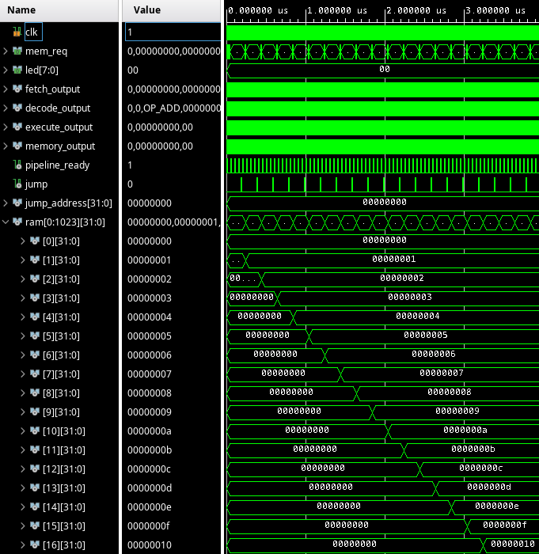
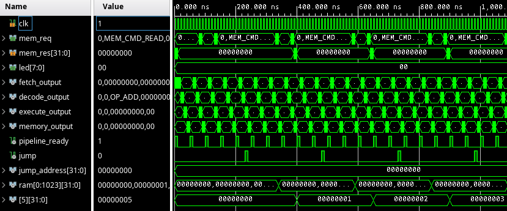
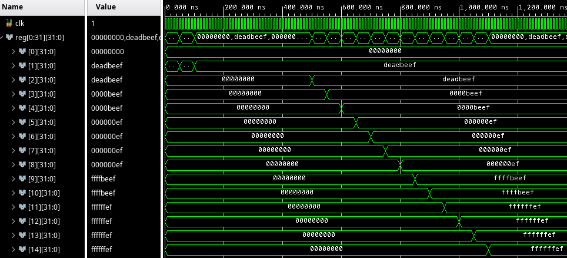

{
	"title": "Memory"
}

This lesson starts at commit [c2c6ad9e07ff149a1de3863f1d10db636e966997](https://github.com/rubenvannieuwpoort/course_cpu/commit/c2c6ad9e07ff149a1de3863f1d10db636e966997).

# 8. Memory

We'll start with a simple implementation of the memory subsystem, which we need for the load and store instructions. There is quite a lot which we'll need to do for this module, so we'll start on familiar ground and take small steps.

We'll start by implement the store instructions, and specifically, the `SW` (store word) instruction. The familiar ground we're starting from is the decoder; we'll just do what we have done dozens of times before: Add some decoding logic.

The RISC-V docs say this about the store instructions:
> Load and store instructions transfer a value between the registers and memory. [...] The effective address is obtained by adding register *rs1* to the sign-extended 12-bit offset. [...] Stores copy the value in register *rs2* to memory.

We'll use the first operand to store the address and the second operand to store the value. For now, I'll assume that stores are aligned to a multiple of 4 bytes. The RISC-V specification allows raising exceptions for misaligned memory access (but for now, we will stick to implementing aligned stores, and leave exceptions for later).

!!Add decoding logic for SW

Now we want to start implementing the `OP_SW` operation in the execute stage.

!!Add placeholder for OP_SW in execute stage

Hm, we're a bit stuck here. We want to talk to some kind of memory interface or wrapper, which I'll pompously call "memory subsystem". We'll need to output at least:
- An indicator value to indicate we want to write
- The address to write to
- The value to write

The memory subsystem will be placed outside the core, since there are other components that want to "talk" to the memory. So, I'll make a record for these signals, but place it outside of the `core` folder.

!!Add record for store

Now, we want to make a new module for the memory subsystem.

!!Make mem_subsys module

Now, we want to instantiate the `mem_subsys` module in the `top_level`, and route the signals from the execute stage to the memory subsystem, crossing the interface of the `core` module. So, here we go.

!!Instantiate memory subsystem and route memory requests from execute stage

Now implementing `OP_SW` in the execute stage is simple.

!!Implement OP_SW

Now we need to implement the memory subsystem itself. In the spirit of "doing the simplest thing that could work", we can just make a vector of `std_logic_vector`s like we did for the registers. Let's make it 4KB big, which means it's 1024 words, since words consists of 4 bytes.

!!Add a first implementation of the memory subsystem

Now, let's write a simple program that increments a counter, and uses the counter as both the address and the value to write. Since the address is in bytes but we're writing words, we'll shift the address to the left by two bits, which makes sure the address is a multiple of 4 so that our stores are aligned.

```
loop:
sll x2, x1, 2
sw x1, 0(x2)
addi x1, x1, 1
j loop
```

This assembles to
```
00209113
00112023
00108093
ff5ff06f
```

!!Put test program for SW in instruction memory

And... This looks good! Our memory gets filled, word by word.


Now, I want to proceed by implementing the `LW` (load word) instruction. This is somewhat similar to storing a word, in that the execute stage will signal an address to the memory subsystem, and the memory subsystem will act on it.

However, the memory subsystem needs to know if it has to perform a read or a write command. So let's add a type and field for it.

!!Add type and field for memory command

Now, we still need to set the proper command in the execute stage.

!!Set write command when writing

We are now ready to start implementing `LW`. First, we add an operation for it.

!!Add OP_LW

We are now ready to decode `LW` instructions. The address computation is the same as for the `SW` instruction, but this time we need to set the destination register.

!!Decode LW instructions

Now we can tell the memory subsystem to read from the execute stage.

!!Send read commands from execute stage

We still need to implement reading in the memory subsystem. I'll add an output named `res` (for "response").

!!Implement reads in memory subsystem

This output needs to be routed back to the core.

!!Implement reads in memory subsystem

Now, we want to route it back to some stage. When the execute stage writes its output, the memory stage is running (for one cycle). At the same time, the memory subsystem is also doing the read. So, the output from the read will not arrive in time for the memory stage; we can only use it in the writeback stage. So, we are not doing anything in the memory stage, except just adding a single-cycle delay to make sure the value that is read from the memory arrives in time for the writeback stage.

!!Route memory response to writeback stage

Now, as a last step, the execute stage needs to tell the writeback stage that it has to store the response from the memory in the destination register, instead of the `result` output from the execute stage. For this, I add a `use_mem` flag to the output of the execute stage. It needs to be routed through the memory stage, so I'll add it to the output of the memory stage as well.

!!Add use_mem flag

Now, we need to set this flag in the execute stage whenever we perform a read.

!!Set use_mem flag for LW

Finally, we need to update the writeback stage to actually write back the memory response when the `use_mem` flag is set.

!!Use memory response in writeback when is_mem is set

That's it, I guess? We can adapt our program from before by adding a load of the same address immediately after the store.

```
loop:
sll x2, x1, 2
sw x1, 0(x2)
lw x5, 0(x2)
addi x1, x1, 1
j loop
```

This assembles to
```
00209113
00112023
00012283
00108093
ff1ff06f
```

So we'll put this in the instruction memory.

!!Put test program for loads in the instruction memory

When we simulate this... It doesn't work?

After tracing the signals, it becomes obvious we forgot to pass the `use_mem` flag in the memory stage. We can just update it to also copy this flag:

!!Pass use_mem in memory stage

Actually, since the memory stage does nothing, we can just remove the `memory_output_t`, since it is exactly the same as `execute_output_t`. So let's do a bit of cleanup and remove the `memory_output_t` and associated constants, and replace it by `execute_output_t` whenever it's used.

!!Remove memory_output_t and clean up usage

The memory stage can now be simplified.

!!Simply memory stage implementation

We now want to simulate this. From now on, we'll always want to use `top_level_tb.vhd`, because just the core is not enough. We might as well delete it to avoid confusion.

!!Delete core_tb.vhd

If we now simulate for 500ns and watch the `x5` register, we can see the successive values getting loaded.



Next, we're going to implement byte and halfword reads, which require us to write only some of the bytes, instead of always the whole 32-bit word.

To support this, I am going to copy and edit some code from AMD's docs, that is supposed to infer a block RAM. This code supports a "write enable" input, which I want to use.

!!Add modified version of code to infer block ram

Now, we'll hook up the `mem_subsys` code to use this `bram`.

!!Use bram in mem_subsys

In simulation we see that our memory subsystem works just as before. However, we now have a `wea` signal that we can use to implement writes that only write some bytes. We want to pass this directly from the execute stage so that we can implement halfword- and byte-sized loads and stores.

!!Set write_enable in execute stage

Now, let's first focus on writing, and in particular, the `SB` instruction. Since we store words as-is, and RISC-V (like most modern systems) is little-endian, we have to make sure that byte writes that are to an address aligned to 4 bytes end up in the least significant byte of the word. Likewise, byte writes to an address that ends in `01` end up in bits 15 down to 8, writes to an address that ends in `10` end up in bits 23 down to 16, and writes to an address ending in `11` end up in bits 31 down to 24.

All, in all, we get the following change.

!!Implement SB

The `SH` instruction is very similar.

!!Implement SH

Reading of bytes and halfwords is a lot trickier. We made it so that the response from the memory only arrives in the writeback stage. This is simple when we can store the word in a register without changes, but for the `LBU` and `LHU` instructions we need to "pad" the bytes or halfwords with some zeros, and for `LB` and `LH` instructions we even need to do sign extension.

So, in addition to the `use_mem` flag, the execute stage also needs to pass:
- The size of the memory read
- If the memory read needs to be sign-extended
- The lower two bits of the address (reads are always word-sized and we need to determine which bits to grab)

!!Pass additional data and flags in execute output

Let's now update the implementation of `OP_LW` to use these extra fields.

!!Update LW implementation

Now we can implement `LBU`.

!!Implement LBU

`LHU` is similar.

!!Implement LHU

`LB` is similar to `LBU` but we need to add sign extension.

!!Implement LB

Finally, we get to `LH` which is similar to `LB` again.

!!Implement LH

The execute stage now contains a lot of duplicated code, so we'll do a bit of cleanup.

!!Clean up code for loads in execute stage

Come to think of it, reads and writes should cause an exception when they are misaligned, but we did not implement exceptions yet. Better add some comments to remind ourselves when we get to that.

!!Add TODOs for adding exceptions for misaligned loads and stores

Now, to test the loads and stores we add a small test program to our instruction memory, which is the result of assembling
```
li x1, 0xdeadbeef

# stores

sw x1, 0(x0)

sh x1, 4(x0)
sh x1, 10(x0)

sb x1, 12(x0)
sb x1, 17(x0)
sb x1, 22(x0)
sb x1, 27(x0)


# unsigned loads
lw x2, 0(x0)

lhu x3, 4(x0)
lhu x4, 10(x0)

lbu x5, 12(x0)
lbu x6, 17(x0)
lbu x7, 22(x0)
lbu x8, 27(x0)


# signed loads
lh x9, 4(x0)
lh x10, 10(x0)

lb x11, 12(x0)
lb x12, 17(x0)
lb x13, 22(x0)
lb x14, 27(x0)


hang:
j hang
```

!!Put test program for loads and stores in instruction memory

Simulating this for 1500 ns, we get the following waveforms.



For the unsigned loads we expect
- The `LW` instruction to load the full word `0xdeadbeef`
- The `LHU` instructions to load `0x0000beef`
- The `LBU` instructions to load `0x000000ef`

For the signed loads we expect
- The `LHU` instructions to load `0xffffbeef`
- The `LBU` instructions to load `0xffffffef`

This all looks good, so we're done with the load and store instructions for now!
